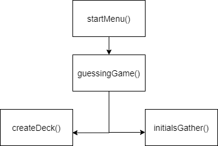
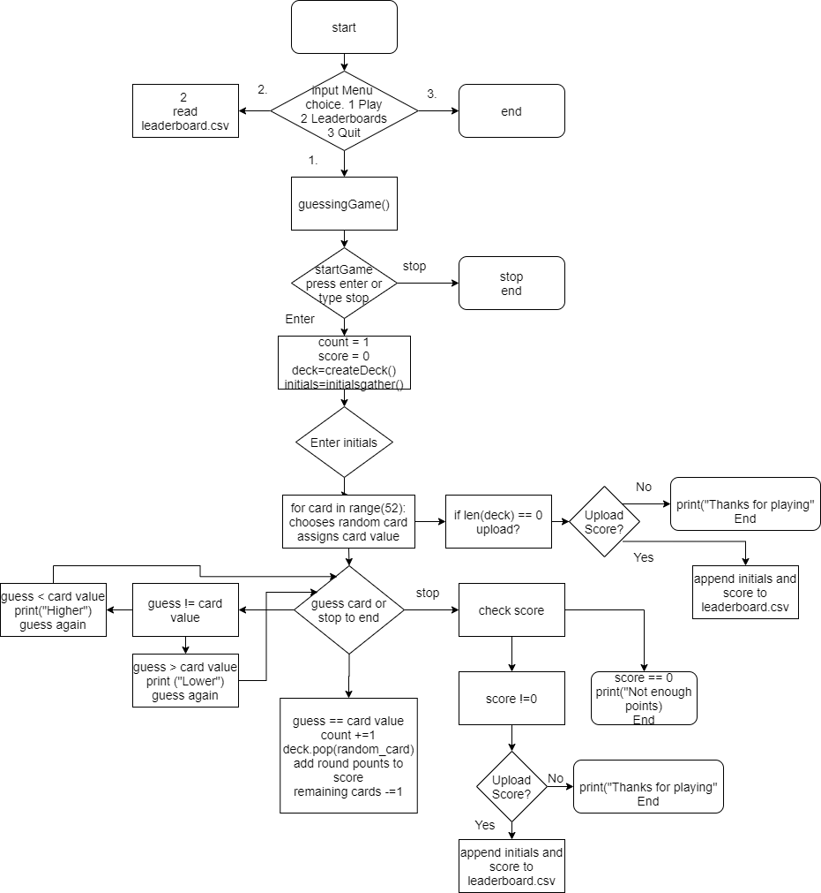

##Hierarchy Chart

##Flow Chart

##Pseudocode
####startMenu()
####make selection, 1 play, 2 leaderboards, 3 quit
    if 3 then end
    if 2 then display leaderboards then new menu prompt
    if 1 then guessingGame()
####start game press enter or stop to end
    if stop then end
    if enter pressed then:
        count = 1
        score = 0
        deck = createDeck()
####createDeck()
    reads ranks and suits from csv, assigning value based on rank and appends to deck dictionary        

####get initials from initialGather()
    reads only first three characters, accepts numbers
    strips and uppercases the string
    sets as variable initials
    returns initials
####for 52 iterations or until stopped.
    if len(deck) = 0
        print("Congratulations")
        upload to leaderboard?
            yes: appends initials and score to leaderboard
            no: end
    guess the card value
    if guess < card value
        print higher
        deduct 2 possible points
    if guess > card value
        print lower
        deduct 2 possible points
    if guess = card value
        count +=1
        remove card from deck
        add round points to score
        remaining cards -= 1
    if guess == stop
        if score == 0
            end
        if score != 0
            upload to leaderboard?
                yes: appends initials and score to leaderboard
                no: end

###IPO
## **Input conditions**
 |Input Name|Valid Data Type(s)|Where does it come from|Valid Value(s)|Tests|
|------------|--------------------|-------------------------|----------------|-------|
|menuSelect | String | User input | 1 to 3 | Not 1,2, or 3|
|startGame|String|User input|Anything but stop to launch | startGame == stop|
|Initials| String| User input| Any 3 digit character combination |  Any spaces(Not Allowed)|
|Deck Value| Integer | createDeck()| 1-10 | None| 
|Guess| Integer | User input | Any | Over 10 (Wrong)|
|Upload Score | String | User input | y, yes, n, no | if not valid 
## **Output Conditions**
|Output Name|Valid Data Type(s)|Where does it come from|Valid Value(s)|Tests|
|------------|--------------------|-------------------------|----------------|-------|
|Score| Integer | Constant, added with points |Any numeral >= 0 | none
|Points| Integer| Constant, each round starts at 20, subtract 2 every wrong guess|Any numeral >=0| <0(points = 0)
## **Processes**
|Process Name|Valid Data Type(s)|Where does it come from|Valid Value(s)|Tests|
|------------|--------------------|-------------------------|----------------|-------|
|Leaderboard| CSV | menuSelect | leaderboard.csv| file not found|
|createdeck()| Integer and string| createdeck()| Spade, Club, Heart, Diamond, 1-10, Jack, Queen, King, Ace | none|
|randomCard | Integer and string | deck | Spade, Club, Heart, Diamond, 1-10, Jack, Queen, King, Ace | none
